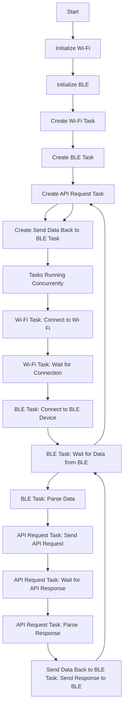

# EvenESP Coex

A single ESP32S3 controller using BLE and WiFi STA coexistence.

# EvenESP Dual

A dual ESP32S3 controller for the Even Realities G1 glasses written in C with ESP-IDF.

One (1) ESP32S3 will handle the BLE communication with the Even Realities G1 glasses, while the other (1) ESP32S3 will handle the WiFi communication with the internet.

The two ESP32S3s will communicate with each other through a UART connection.

## TODO

- [x] Get BLE working
- [ ] Get BLE working to two devices simultaneously
- [ ] Get WiFi working
- [ ] Get communication between the two ESP32S3s working

## Work

- [ ] MicroPython for the wifi ESP32S3?

